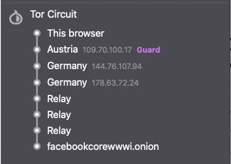

## Resolução TPC3 - Aula 4

#### Pergunta 1.1

Não. Ao efetuar o comando ```sudo anonsurf start``` é impossível garantir que o IP esteja localizado nos EUA.
A razão pela qual é impossível obter tais garantias, é que, aquando da geração de um circuito de nodos pelo *Onion Proxy*, essa mesma geração é aleatória. Devido a isso, é impossível garantir que o IP do último nodo do circuito seja nos EUA.

#### Pergunta 1.2

Após a consulta deste [sítio](https://www.facebookcorewwwi.onion/), foi obtido o circuito apresentado em baixo. Tal como era esperado, existem 6 "saltos" até ao sítio *Onion* sendo três deles *relay*, que correspondem aos OR do servidor do sítio. 

Tendo em conta que são escolhidos três OR, tanto pelo servidor como pelo cliente, o ponto de comunicação entre esses OR é o *Rendezvous Point*, escolhido pelo cliente para construir o circuito TOR. Por fim, é necessária a existência de saltos *relay* para que possam ser transmitidos dados necessários para o estabelecimento da conexão.


